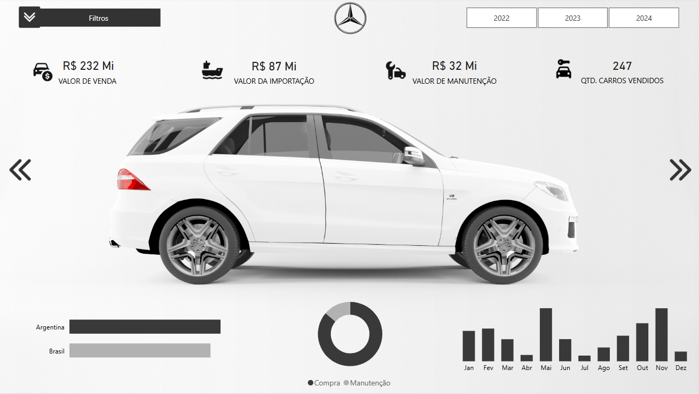
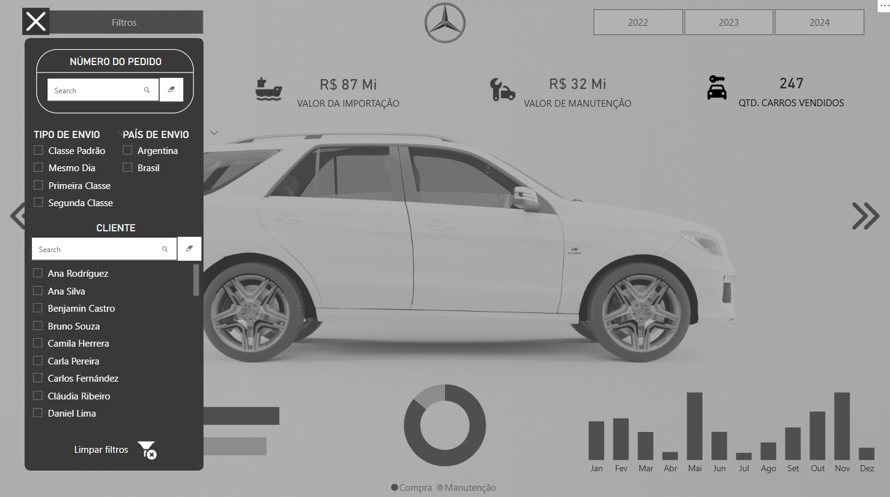
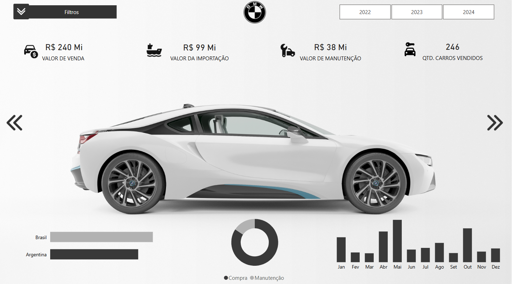

# 🚗📦 PROJETO POWER BI - IMPORTAÇÃO & EXPORTAÇÃO DE VEÍCULOS

Repositório de estudos dedicado ao desenvolvimento de um dashboard analítico no Power BI, visando usar Inteligencia Artificial para a criação do banco de dados e design do mesmo. Com foco na gestão de dados de importação e exportação de veículos.

---

## 📊 Descrição do Projeto

O projeto tem como objetivo central a criação de um painel interativo que permite visualizar e analisar dados relacionados ao comércio internacional de veículos, abrangendo informações como:

- Volume de veículos importados e exportados.
- Faturamento.
- Análise de veículos comercializados.
- Desempenho logístico.
- Análise de clientes, fornecedores e regiões

---

## 🚀 Funcionalidades

- 🚗 Visualização do volume de veículos por país de origem e destino.
- 📦 Análise de faturamento e desempenho comercial.
- 🌎 Distribuição geográfica das operações de importação e exportação.
- 🔍 Filtros dinâmicos por modelo de veículo, tipo de serviço, país, estado e data.
- 📈 Indicadores chave (KPI) de desempenho operacional e comercial.

---

## 🖼️ Imagens do Dashboard

---

## 💾 Sobre os Dados

> ⚠️ **Atenção:** Os dados utilizados são fictícios, gerados exclusivamente para fins educacionais e demonstração de recursos analíticos no Power BI.

---

## 👨‍🏫 Créditos

- 📚 Projeto desenvolvido com base no canal **The Developer - Youtube**.
